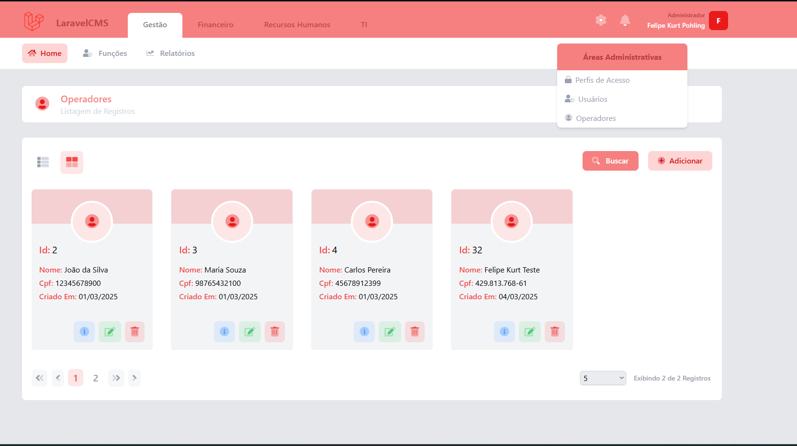
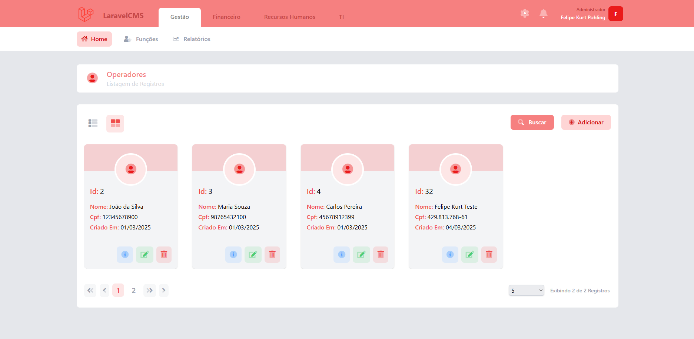
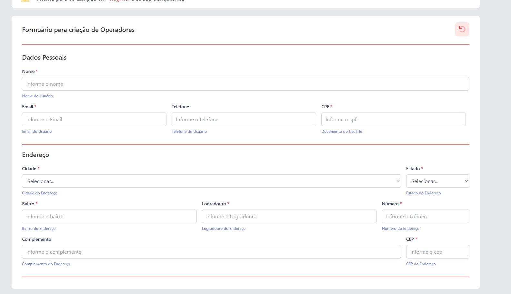
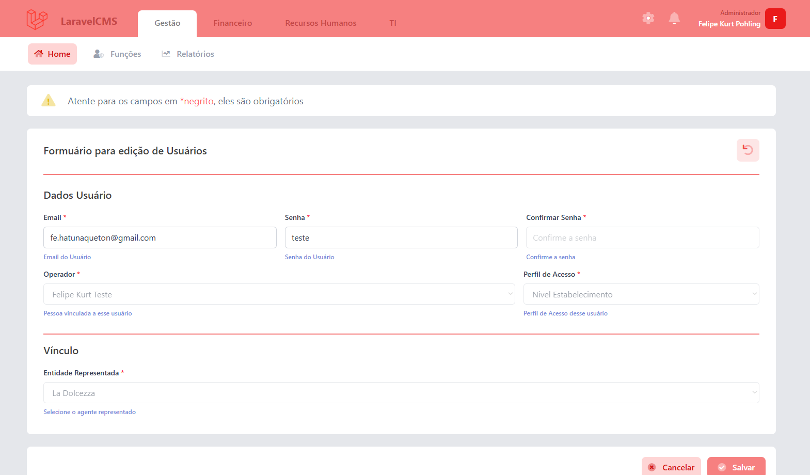

# LaravelCMS 🚀

**LaravelCMS** é um template para desenvolvimento ágil de sistemas em Laravel. Ele permite a criação de CRUDs automáticos a partir de arquivos `.yaml`, eliminando a necessidade de escrever código manualmente para cada entidade. Além disso, oferece suporte para views personalizadas, garantindo flexibilidade e eficiência para diferentes cenários de desenvolvimento.

## ✨ Principais Recursos

✅ **CRUD Automático** – Defina suas entidades no banco de dados via arquivos `.yaml` e gere automaticamente as operações de **criação, edição, listagem e exclusão**.  
✅ **Flexibilidade com Views Personalizadas** – Utilize a renderização genérica ou defina suas próprias views para casos específicos.  
✅ **Código Genérico e Extensível** – Toda a lógica está abstraída em PHP, permitindo personalizações conforme necessário.  
✅ **Eficiência no Desenvolvimento** – Mesmo para tabelas simples, como categorias e configurações auxiliares, o LaravelCMS acelera o processo de desenvolvimento.  
✅ **Integração Total com Laravel** – Compatível com os padrões do Laravel, permitindo fácil adaptação e expansão.  

## 🛠 Como Funciona?

1. **Defina suas entidades** no formato `.yaml`, descrevendo os campos e propriedades do banco de dados.  
2. **O LaravelCMS interpreta esses arquivos** e gera automaticamente a estrutura do CRUD.  
3. **Escolha entre a view genérica ou uma personalizada**, garantindo flexibilidade para diferentes casos de uso.  
4. **Acelere o desenvolvimento** sem perder a capacidade de customização onde for necessário.  

## Imagens

